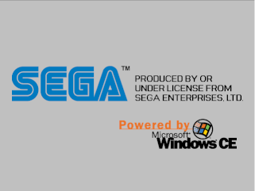

# makeip

Tool to create IP.BIN files that are used to make self bootable CD-Rs for the Sega Dreamcast.

This is basically an enhancement on Marcus Comstedt's work. We can now use command arguments to
generate an IP.BIN and we no longer depend on the IP.TMPL file. Its also backwards compatible so
you can still use the ip.txt if you choose. Another enhancement is MR Image insertion into the 
IP.BIN. This image is shown during the boot screen. For example:




Included in this repo is a plugin(**file-mr.py**) you can use to create .mr images in GIMP. **Make sure to read the MR Image Restrictions restrictions**

## Building

Linux: ```gcc makeip.c```

Unix: ```cc makeip.c```

Windows: ```cl makeip.c```

## Usage
```
makeip [options] IP.BIN
makeip ip.txt IP.BIN
    
Options:
    -b <bootfilename> Boot filename (default: 1ST_READ.BIN)
    -c <companyname>  Company name (default: COMPANY)
    -d <releasedate>  Release date (format: YYYYMMDD, default: 20000627)
    -g <gametitle>    Name of the software (default: GAMETITLE)
    -h                Usage information
    -i <mrfilename>   Insert a mr image into the IP.BIN
    -v <version>      Product version (default: V1.000)
```

## GIMP Plugin

GIMP is a cross-platform image editor available for GNU/Linux, OS X, Windows [https://www.gimp.org/]

Using this plugin, you can load and save .mr files that you've created in GIMP. It was only tested on the latest
Gimp 2.10 but I believe it would also work for Gimp 2.8.

**Installing:**

1. You'll need to make it executable: ```chmod 755 file-mr.py``` or the equivalent from your file manager.
2. Place the plugin in the plugins directory. This directory is different depending on what system your on.  
   To find out go to GIMP => Preferences => Folders (*Expand option*) => Plugins.  There it will show a list 
   of directories you can place the plugin.
3. That's it!

## MR Image Restrictions

**Image must be:**

1. **320x90** or less
2. Less than **128** colors
3. Less than **8192** bytes to fit in a IP.BIN
4. The transparent color is **#c0c0c0**, or 192, 192, 192 in RGB.

## Acknowledgments

* Marcus Comstedt [http://mc.pp.se/dc/sw.html] (Originally coded makeip)
* Andrew Kieschnick [http://napalm-x.thegypsy.com/andrewk/dc/)] (Code to insert .mr images into IP.BIN from logotools[logoinsert.c])
* SiZiOUS [http://sbibuilder.shorturl.com/] (Code to decode .mr images from sbinducer[mrimage.pass])

## License

This project is licensed under the BSD 2-clause "Simplified" License - see the [LICENSE.md](LICENSE.md) file for details